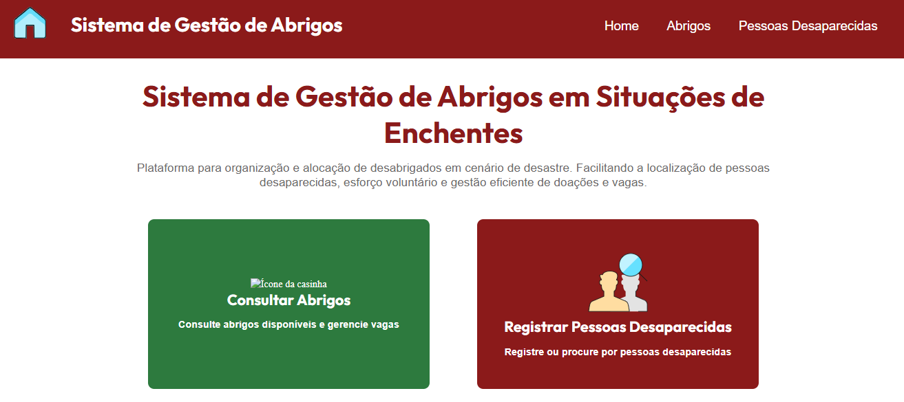
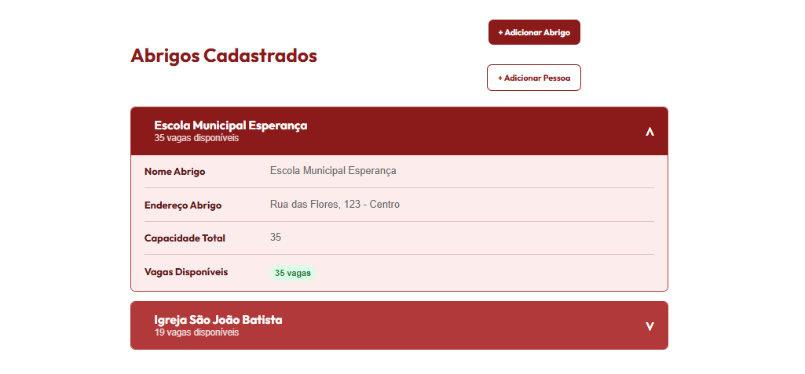
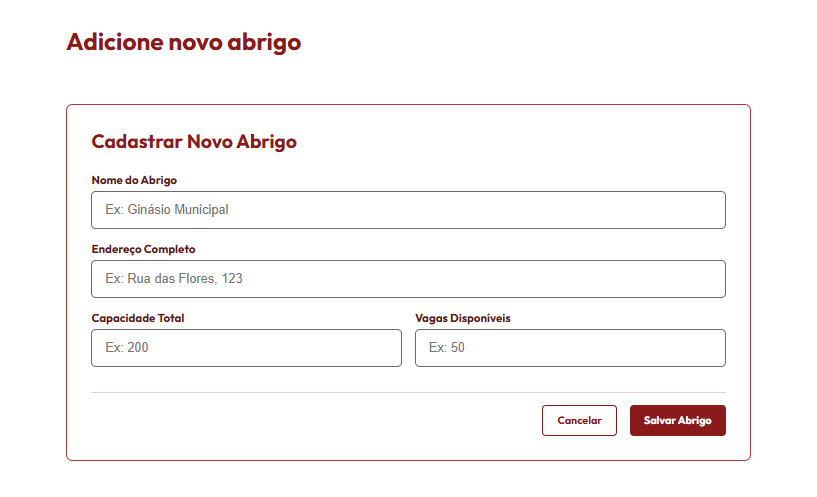

# 🚀 Desafio Final - Empower 5.0

## Ênfase no Front End e no consumo da construção da API

### Este projeto foi desenvolvido a partir de um desafio sobre enchentes no Brasil. Ao analisar o cenário, identifiquei a dificuldade relacionada à falta de informação sobre abrigos, o que motivou a criação desta solução. Tendo em vista que a organização dos abrigos agiliza tanto a localização de pessoas desaparecidas quanto o esforço voluntário e as doações, este projeto tem como pilar a organização das informações e a promoção de maior agilidade na gestão de vagas em abrigos

---
 ## Apresentação do Projeto - Tela Home
<p align="left"> 
    
</p>

## 🚀 Tecnologias Utilizadas no Back e no Front

<p align="left">
    
    
    
    
    
    
</p>


## ▶️ Como Rodar o Projeto

**1º Clone este repositório:**

```bash
git clone https://github.com/paulohenriquemoreira/projetoFinalFullStack-FrontEnd
cd projetoFinalFullStack-FrontEnd
```

**2º Instale as dependências:**

```bash
npm install
```

**3º Inicie o servidor:**

```bash
npm run dev
```

> Servidor rodando em: `http://localhost:3000`

-----

**Instale os pacotes:**

```bash
npm sass
npm nodemon
npm sqlite3
npm sqlite
npm cors
npm axios

```

## 🗄️ Estrutura do Banco de Dados

O banco de dados `database.db` é relacional e utiliza chaves estrangeiras para ligar pessoas a abrigos.

### Tabela: Abrigos

| Campo | Descrição |
| :--- | :--- |
| id | Identificador único (PK) |
| nome\_abrigo | Nome da instituição |
| endereco\_abrigo | Localização completa |
| capacidade\_total | Limite de ocupação |
| vagas\_disponiveis | Vagas atuais (atualizado dinamicamente) |
| aceita\_pet | "1" para Sim, "0" para Não |
| data\_registro | Data de criação (Formatada DD/MM/AAAA) |

### Tabela: Pessoas (Desaparecidos/Abrigados)

| Campo | Descrição |
| :--- | :--- |
| id | Identificador único (PK) |
| nome\_completo | Nome do cidadão |
| data\_nascimento | Data de nascimento (para verificação) |
| endereco\_residencial | Último endereço conhecido |
| id\_abrigo | Vínculo com o abrigo (FK) |

-----

## 🔗 Principais Endpoints

### 🏠 Gestão de Abrigos (`/abrigos`)

  * **POST `/abrigos`**: Registra um novo ponto de acolhimento.
  * **GET `/abrigos`**: Lista todos os abrigos com datas formatadas.
  * **PUT `/abrigos/:id`**: Atualiza dados de capacidade ou localização.
  * **DELETE `/abrigos/:id`**: Remove o abrigo do sistema.

   ## Apresentação do Projeto - Telas Abrigo - Cadastrar Abrigo - Registrar Pessoa no Abrigo
<p align="left"> 
    
    
    
</p>

### 👥 Gestão de Pessoas (`/pessoas`)

  * **POST `/pessoas`**: Registra uma pessoa.
      * *Regra de Negócio*: O sistema varre todos os abrigos. Se a pessoa já estiver cadastrada, retorna o nome e o endereço do abrigo onde ela se encontra.
      * *Automação*: Ao cadastrar, o sistema subtrai automaticamente uma vaga do abrigo correspondente.
  * **GET `/pessoas`**: Lista pessoas com `LEFT JOIN`, exibindo em qual abrigo cada uma está localizada.
  * **DELETE `/pessoas/:id`**: Remove o registro e devolve automaticamente a vaga ao abrigo.

-----

   ## Apresentação do Projeto - Tela Pesquisa de Pessoa Registrada e Resultado de Pesquisa

<p align="left"> 
    
</p>


   ## Apresentação do Projeto - Tela de Resultado de Pesquisa

<p align="left"> 
    
</p>


## 🧠 Inteligência do Back-End

  * **Validação de Duplicidade**: Comparação de `nome_completo` + `data_nascimento` em toda a base de dados.
  * **Integridade Relacional**: Uso de `Foreign Keys` para garantir que uma pessoa esteja sempre vinculada a um abrigo válido.
  * **Padronização Local**: Datas convertidas via SQL (`strftime`) para o padrão brasileiro **DD/MM/AAAA**.
  * **Segurança**: Implementação de queries parametrizadas contra SQL Injection.


  -----

## 👨‍💻 Autor

**Paulo Henrique Moreira** - 2026  
*Projeto desenvolvido para fins educacionais - Formação Full Stack.*
